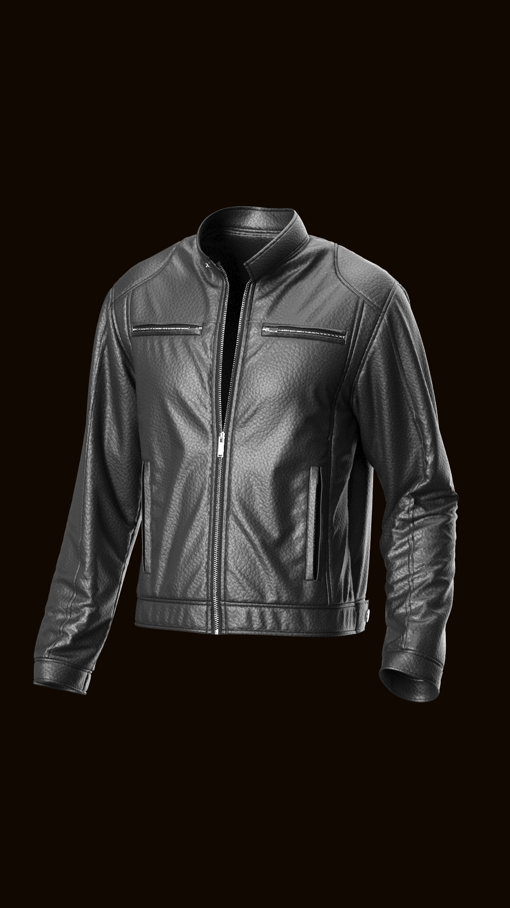
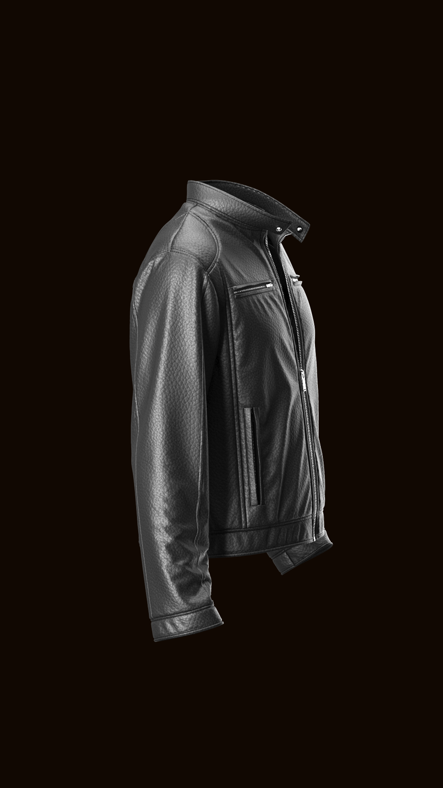
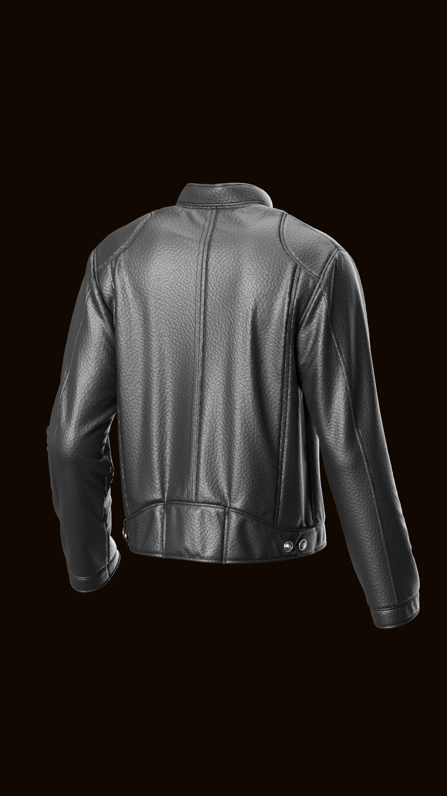

## System Prompt

````
Act as a master 3D technical fashion designer and an elite Image-to-Video prompt engineer. I am providing you with multiple reference images of a single 3D garment designed in CLO 3D from different angles.

Step 1: Deep Visual Audit
Analyze all provided images simultaneously. Break down every single visual and structural feature into an exhaustive technical inventory:

- Fabric & Materiality: Exact weave, glossiness, weight, opacity, texture depth (e.g., brushed matte leather, ribbed knit, 4-way stretch nylon), and surface normals.
- Construction & Tailoring: Exact silhouette, paneling, seam placements, topstitching patterns, darts, hems, cuffs, and collar structure.
- Hardware & Accents: Exact positions, colors, and materials of zippers, buttons, rivets, eyelets, cords, buckles, and patches.
- Form & Silhouette: How the garment drapes, natural folds, creases, and structural volume.

Step 2: Generate the Final Image-to-Video Prompt
Using the exhaustive inventory from Step 1, generate a single, highly dense, ready-to-use Image-to-Video prompt (in English) designed for a 360-degree turntable video render (9:16 vertical ratio).

Requirements for the final prompt:
- Explicitly list every specific feature identified in Step 1 so the video model is semantically anchored to the exact design.
- Enforce a static 3D turntable / smooth 360-degree camera orbit around the asset.
- Include strict negative constraints explicitly prohibiting any morphing or alterations to the specific features you listed.

Output ONLY the finalized prompt ready to copy-paste, followed by a matching Negative Prompt.
````

## How It Works (Two-Stage Workflow)

This is a **meta-prompt**: instead of describing a video directly, it makes the LLM build the video prompt for you, grounded in the actual garment.

**Stage 1 — Analysis & Generation**

1. Paste the System Prompt above into a multimodal LLM (tested with Gemini 3.7 Flash).
2. Attach **multiple reference images of the same garment** (e.g., front / side / back renders exported from CLO 3D).
3. The LLM audits every feature, then writes a **bespoke Stage-2 prompt**: instead of generic phrases, it names each component of *that specific garment* (e.g., "black pebbled leather cafe racer jacket with an asymmetric silver center-front zipper, double-stitched collar, twin chest zip pockets").

**Stage 2 — Video Creation**

4. Copy the generated prompt **verbatim** and send it to your image-to-video model **together with the main reference image**.
5. The result is a seamless 360° turntable video that preserves the garment's design identity.

## Variables

| Variable | Description | Default |
|----------|-------------|---------|
| `{{REFERENCE_IMAGES}}` | 2–8 renders of the same garment from different angles | front, side, back |
| `{{ASPECT_RATIO}}` | Output video ratio in the final prompt | 9:16 vertical |
| `{{CAMERA_MOVE}}` | Camera behavior enforced in the final prompt | static 360° turntable orbit |

## Example: Black Leather Cafe Racer Jacket

Real run of this prompt on a CLO 3D cafe racer jacket (see [`examples/leather-cafe-racer-jacket/`](examples/leather-cafe-racer-jacket/)).

**Input — reference images:**

| Front | Side | Back |
|-------|------|------|
|  |  |  |

**Output — generated Stage-2 prompt** (full text: [`generated-video-prompt.md`](examples/leather-cafe-racer-jacket/generated-video-prompt.md)):

````
Seamless 360-degree turntable studio video orbit around a floating, invisible ghost-mannequin 3D black pebbled leather cafe racer jacket, 9:16 vertical orientation. The garment remains completely static, rigid, and geometrically locked in place as the camera performs a smooth, continuous circular orbit.

Garment features:

Materiality & Texture: Heavyweight tumbled black leather with high-relief pebble-grain normal maps, realistic micro-surface roughness, and subtle specular highlights along seam edges and natural folds. Smooth matte black interior lining visible at the hollow collar opening.

Collar & Closure: Rigid mandarin band collar standing upright with a snap closure notch; center-front exposed polished silver metal zipper partially unzipped at the top, featuring defined metallic teeth and a rectangular pull tab.

Pockets & Paneling (Front): Dual symmetrical horizontal chest pockets with exposed silver zippers; dual vertical welt hand-warmer pockets along the lower front body; curved anatomical shoulder/yoke panels running seamlessly into the armscye; twin vertical structural seams framing the front torso.

Back & Tailoring: Multi-panel back construction featuring a central vertical spine seam, curved upper back saddle yoke, vertical contouring side back seams, and a fitted bottom waistband.

Waist & Cuffs: Bottom waistband with side-back adjustment tabs anchored by twin polished silver snap studs; articulated two-piece sleeves with natural elbow flexion and horizontal accordion creases; structured topstitched cuff bands with hollow wrist openings.

Environment & Lighting: Garment floats in zero-gravity against a pitch-black studio background (#000000), illuminated by soft rim lighting and high-contrast studio key lights accentuating the leather grain and hardware reflections.

Negative Prompt:

human body, visible mannequin, avatar, flesh, head, hands, limbs, garment morphing, shifting seams, disappearing zippers, migrating pockets, texture swimming, flickering, changing leather grain, moving sleeves, fluttering fabric, cloth simulation movement, wind, physics deformation, camera wobble, fast panning, zoom in, zoom out, color changes, low resolution, motion blur, distorted geometry, extra zippers, missing snap buttons, background change, light leaks.
````

**Resulting video** — seamless 360° turntable, design identity preserved:
[`examples/leather-cafe-racer-jacket/output-seamless-360-turntable.mp4`](examples/leather-cafe-racer-jacket/output-seamless-360-turntable.mp4)

## Notes & Best Practices

- **Cover every angle**: the Stage-2 prompt can only name features visible in the reference images. Anything the camera never saw (inner lining, hidden hardware) will be invented by the video model.
- **Always pair the Stage-2 prompt with the main image**: the prompt semantically anchors the video model; the image anchors it geometrically. Using both is what keeps the identity stable across the orbit.
- **Keep the negative prompt**: it is generated against the exact features listed in the positive prompt (e.g., "disappearing zippers" for a zip-heavy jacket). It is the main defense against morphing seams and migrating pockets mid-orbit.
- **Garment static, camera moving**: the prompt deliberately locks the garment "geometrically in place" and moves only the camera — asking for wind, walking, or cloth simulation will break identity fidelity.
- Stage 1 works best with multimodal models that handle multi-image input well (e.g., Gemini); Stage 2 works with any image-to-video model that accepts a prompt + start image.

## Version History

- v1.0.0 — Initial release: two-stage workflow (image audit → bespoke turntable prompt), validated end-to-end on a CLO 3D leather cafe racer jacket with a 360° turntable output.
